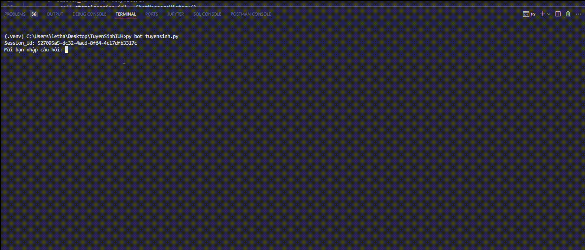

# IUH CHATBOT ADMISSIONS USING LANGCHAIN

[](LICENSE)

This project is a chatbot for admissions at IUH. It uses the LangChain library and RAG to process natural language. 
<!-- [here](https://iuh-chatbot-admissions.herokuapp.com/). -->
This project is a part of the course "Data Platform and Applications" at IUH.

This project runs using Python 3. It requires `langchain`, `faiss`, and `PyMuPDF`. To install it as a Python package, follow the following steps:

Step 1: clone this repo, and go inside that repo:
```bash
$ git clone [HTTPS or SSH linnk to this repo]
$ cd TuyenSinhIUH
```
Step 2: install using pip

```bash
$ pip3 install -r requirements.txt
```

## Usage
To run this project simply run the following command:
```bash
$ python3 bot_tuyensinh.py
```
#### Example

